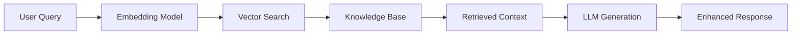

# 🎯 Building Retrieval-Augmented Generation (RAG) Applications: A Developer's Complete Guide

Retrieval-Augmented Generation (RAG) represents one of the most practical and powerful applications of Large Language Models in production environments. Unlike fine-tuning, RAG allows you to enhance LLM capabilities with your specific knowledge base without retraining models.

In this comprehensive guide, we'll build a production-ready RAG application from the ground up, covering everything from architecture decisions to deployment strategies.

## 🏗️ Understanding RAG Architecture

### The Core Concept
RAG combines two powerful components:
1. **Retrieval System**: Finds relevant information from your knowledge base
2. **Generation System**: Uses LLM to generate responses based on retrieved context



### Why RAG Over Fine-tuning?
- ✅ **Real-time updates**: Add new information without retraining
- ✅ **Cost-effective**: No expensive model training required
- ✅ **Transparency**: Track which sources inform each response
- ✅ **Scalability**: Handle massive knowledge bases efficiently

## 🛠️ Building Your First RAG System

### Step 1: Environment Setup

```python
# requirements.txt
langchain==0.1.0
chromadb==0.4.18
openai==1.3.0
sentence-transformers==2.2.2
streamlit==1.28.0
python-dotenv==1.0.0
PyPDF2==3.0.1
```

### Step 2: Document Processing Pipeline

```python
import os
from langchain.document_loaders import PyPDFLoader, TextLoader
from langchain.text_splitter import RecursiveCharacterTextSplitter
from langchain.embeddings import HuggingFaceEmbeddings
from langchain.vectorstores import Chroma

class DocumentProcessor:
    def __init__(self, chunk_size=1000, chunk_overlap=200):
        self.text_splitter = RecursiveCharacterTextSplitter(
            chunk_size=chunk_size,
            chunk_overlap=chunk_overlap,
            length_function=len,
        )
        self.embeddings = HuggingFaceEmbeddings(
            model_name="sentence-transformers/all-MiniLM-L6-v2"
        )
    
    def load_documents(self, file_paths):
        """Load documents from various file formats"""
        documents = []
        
        for file_path in file_paths:
            if file_path.endswith('.pdf'):
                loader = PyPDFLoader(file_path)
            elif file_path.endswith('.txt'):
                loader = TextLoader(file_path)
            else:
                continue
                
            documents.extend(loader.load())
        
        return documents
    
    def process_documents(self, documents):
        """Split documents into chunks and create embeddings"""
        # Split documents
        texts = self.text_splitter.split_documents(documents)
        
        # Create vector store
        vectorstore = Chroma.from_documents(
            documents=texts,
            embedding=self.embeddings,
            persist_directory="./chroma_db"
        )
        
        return vectorstore
```

### Step 3: RAG Chain Implementation

```python
from langchain.llms import OpenAI
from langchain.chains import RetrievalQA
from langchain.prompts import PromptTemplate

class RAGSystem:
    def __init__(self, vectorstore, model_name="gpt-3.5-turbo"):
        self.vectorstore = vectorstore
        self.llm = OpenAI(model=model_name, temperature=0)
        
        # Custom prompt template
        self.prompt_template = PromptTemplate(
            input_variables=["context", "question"],
            template="""You are a helpful AI assistant. Use the following context to answer the question.
            If the answer cannot be found in the context, say "I don't have enough information to answer this question."

            Context: {context}

            Question: {question}

            Answer:"""
        )
        
        # Create retrieval chain
        self.qa_chain = RetrievalQA.from_chain_type(
            llm=self.llm,
            chain_type="stuff",
            retriever=self.vectorstore.as_retriever(search_kwargs={"k": 4}),
            chain_type_kwargs={"prompt": self.prompt_template},
            return_source_documents=True
        )
    
    def query(self, question):
        """Process a query and return answer with sources"""
        result = self.qa_chain({"query": question})
        
        return {
            "answer": result["result"],
            "sources": [doc.metadata for doc in result["source_documents"]]
        }
```

## 🚀 Advanced RAG Techniques

### 1. Hybrid Search (Keyword + Vector)

```python
from langchain.retrievers import BM25Retriever, EnsembleRetriever

class HybridRAG:
    def __init__(self, documents, vectorstore):
        # Keyword-based retriever
        self.bm25_retriever = BM25Retriever.from_documents(documents)
        self.bm25_retriever.k = 4
        
        # Vector-based retriever
        self.vector_retriever = vectorstore.as_retriever(search_kwargs={"k": 4})
        
        # Ensemble retriever combining both
        self.ensemble_retriever = EnsembleRetriever(
            retrievers=[self.bm25_retriever, self.vector_retriever],
            weights=[0.5, 0.5]
        )
```

### 2. Re-ranking for Better Relevance

```python
from sentence_transformers import CrossEncoder

class ReRankingRAG:
    def __init__(self, vectorstore):
        self.vectorstore = vectorstore
        self.reranker = CrossEncoder('cross-encoder/ms-marco-MiniLM-L-6-v2')
    
    def retrieve_and_rerank(self, query, top_k=10, final_k=4):
        # Initial retrieval
        docs = self.vectorstore.similarity_search(query, k=top_k)
        
        # Re-rank documents
        doc_texts = [doc.page_content for doc in docs]
        pairs = [[query, text] for text in doc_texts]
        scores = self.reranker.predict(pairs)
        
        # Sort by relevance scores
        ranked_docs = sorted(zip(docs, scores), key=lambda x: x[1], reverse=True)
        
        return [doc for doc, score in ranked_docs[:final_k]]
```

## 🎯 Production Considerations

### 1. Error Handling and Validation

```python
class ProductionRAG:
    def __init__(self, vectorstore, llm):
        self.vectorstore = vectorstore
        self.llm = llm
        self.max_retries = 3
    
    def safe_query(self, question):
        """Query with error handling and retries"""
        if not question.strip():
            return {"error": "Empty question provided"}
        
        for attempt in range(self.max_retries):
            try:
                # Validate input length
                if len(question) > 1000:
                    question = question[:1000] + "..."
                
                # Retrieve relevant documents
                docs = self.vectorstore.similarity_search(question, k=4)
                
                if not docs:
                    return {"answer": "No relevant information found", "sources": []}
                
                # Generate response
                context = "\n".join([doc.page_content for doc in docs])
                response = self.llm.invoke(f"Context: {context}\n\nQuestion: {question}")
                
                return {
                    "answer": response,
                    "sources": [doc.metadata for doc in docs],
                    "confidence": self._calculate_confidence(docs, question)
                }
                
            except Exception as e:
                if attempt == self.max_retries - 1:
                    return {"error": f"Failed to process query: {str(e)}"}
                continue
    
    def _calculate_confidence(self, docs, question):
        """Calculate confidence score based on document relevance"""
        # Implement confidence calculation logic
        return 0.85  # Placeholder
```

### 2. Monitoring and Analytics

```python
import logging
import time
from datetime import datetime

class RAGMonitor:
    def __init__(self):
        self.logger = logging.getLogger("rag_system")
        self.query_stats = []
    
    def log_query(self, question, response, duration):
        """Log query for analytics"""
        self.query_stats.append({
            "timestamp": datetime.now(),
            "question": question,
            "response_length": len(response.get("answer", "")),
            "sources_count": len(response.get("sources", [])),
            "duration": duration,
            "has_error": "error" in response
        })
        
        self.logger.info(f"Query processed in {duration:.2f}s")
    
    def get_analytics(self):
        """Generate system analytics"""
        if not self.query_stats:
            return {}
        
        total_queries = len(self.query_stats)
        avg_duration = sum(q["duration"] for q in self.query_stats) / total_queries
        error_rate = sum(1 for q in self.query_stats if q["has_error"]) / total_queries
        
        return {
            "total_queries": total_queries,
            "avg_response_time": avg_duration,
            "error_rate": error_rate,
            "avg_sources_per_query": sum(q["sources_count"] for q in self.query_stats) / total_queries
        }
```

## 📱 Building a Web Interface

### Simple Streamlit Application

```python
import streamlit as st
from rag_system import RAGSystem, DocumentProcessor

st.set_page_config(page_title="RAG Assistant", page_icon="🤖")

st.title("🤖 RAG-Powered Assistant")
st.write("Ask questions about your uploaded documents!")

# Initialize session state
if "rag_system" not in st.session_state:
    st.session_state.rag_system = None

# File upload
uploaded_files = st.file_uploader(
    "Upload documents",
    type=['pdf', 'txt'],
    accept_multiple_files=True
)

if uploaded_files and st.session_state.rag_system is None:
    with st.spinner("Processing documents..."):
        # Save uploaded files
        file_paths = []
        for file in uploaded_files:
            with open(f"temp_{file.name}", "wb") as f:
                f.write(file.read())
            file_paths.append(f"temp_{file.name}")
        
        # Process documents
        processor = DocumentProcessor()
        documents = processor.load_documents(file_paths)
        vectorstore = processor.process_documents(documents)
        
        # Initialize RAG system
        st.session_state.rag_system = RAGSystem(vectorstore)
        
        st.success("Documents processed successfully!")

# Query interface
if st.session_state.rag_system:
    question = st.text_input("Ask a question:")
    
    if question:
        with st.spinner("Generating answer..."):
            result = st.session_state.rag_system.query(question)
        
        st.write("### Answer")
        st.write(result["answer"])
        
        st.write("### Sources")
        for i, source in enumerate(result["sources"]):
            st.write(f"**Source {i+1}:** {source.get('source', 'Unknown')}")
```

## 🔧 Optimization Strategies

### 1. Caching for Performance

```python
from functools import lru_cache
import hashlib

class CachedRAG:
    def __init__(self, rag_system):
        self.rag_system = rag_system
        self.cache = {}
    
    def _get_cache_key(self, question):
        """Generate cache key for question"""
        return hashlib.md5(question.lower().encode()).hexdigest()
    
    def query_with_cache(self, question, ttl=3600):
        """Query with caching support"""
        cache_key = self._get_cache_key(question)
        
        # Check cache
        if cache_key in self.cache:
            cached_result, timestamp = self.cache[cache_key]
            if time.time() - timestamp < ttl:
                return cached_result
        
        # Generate new response
        result = self.rag_system.query(question)
        
        # Cache result
        self.cache[cache_key] = (result, time.time())
        
        return result
```

### 2. Batch Processing for Efficiency

```python
class BatchRAG:
    def __init__(self, rag_system):
        self.rag_system = rag_system
    
    def batch_query(self, questions, batch_size=5):
        """Process multiple questions efficiently"""
        results = []
        
        for i in range(0, len(questions), batch_size):
            batch = questions[i:i + batch_size]
            batch_results = []
            
            for question in batch:
                result = self.rag_system.query(question)
                batch_results.append(result)
            
            results.extend(batch_results)
        
        return results
```

## 📊 Evaluation and Testing

### RAG Evaluation Framework

```python
from rouge_score import rouge_scorer
from sentence_transformers import SentenceTransformer

class RAGEvaluator:
    def __init__(self):
        self.rouge_scorer = rouge_scorer.RougeScorer(['rouge1', 'rouge2', 'rougeL'])
        self.sentence_model = SentenceTransformer('all-MiniLM-L6-v2')
    
    def evaluate_response(self, question, generated_answer, reference_answer):
        """Evaluate RAG response quality"""
        # ROUGE scores for text overlap
        rouge_scores = self.rouge_scorer.score(reference_answer, generated_answer)
        
        # Semantic similarity
        embeddings1 = self.sentence_model.encode([reference_answer])
        embeddings2 = self.sentence_model.encode([generated_answer])
        similarity = cosine_similarity(embeddings1, embeddings2)[0][0]
        
        return {
            "rouge1": rouge_scores['rouge1'].fmeasure,
            "rouge2": rouge_scores['rouge2'].fmeasure,
            "rougeL": rouge_scores['rougeL'].fmeasure,
            "semantic_similarity": similarity
        }
    
    def evaluate_retrieval(self, question, retrieved_docs, relevant_docs):
        """Evaluate retrieval quality"""
        retrieved_ids = set(doc.metadata.get('id') for doc in retrieved_docs)
        relevant_ids = set(relevant_docs)
        
        precision = len(retrieved_ids & relevant_ids) / len(retrieved_ids) if retrieved_ids else 0
        recall = len(retrieved_ids & relevant_ids) / len(relevant_ids) if relevant_ids else 0
        f1 = 2 * precision * recall / (precision + recall) if (precision + recall) > 0 else 0
        
        return {
            "precision": precision,
            "recall": recall,
            "f1": f1
        }
```

## 🎯 Real-World Applications

### 1. Customer Support Assistant

```python
class CustomerSupportRAG:
    def __init__(self, vectorstore):
        self.rag_system = RAGSystem(vectorstore)
        
        # Custom prompt for customer support
        self.support_prompt = PromptTemplate(
            input_variables=["context", "question"],
            template="""You are a helpful customer support assistant. 
            Use the following knowledge base to answer customer questions.
            Be polite, concise, and helpful. If you cannot find the answer, 
            suggest contacting human support.

            Knowledge Base: {context}

            Customer Question: {question}

            Response:"""
        )
    
    def handle_support_query(self, question, customer_id=None):
        """Handle customer support queries with additional context"""
        # Add customer context if available
        if customer_id:
            question = f"Customer {customer_id} asks: {question}"
        
        return self.rag_system.query(question)
```

### 2. Research Assistant

```python
class ResearchRAG:
    def __init__(self, vectorstore):
        self.rag_system = RAGSystem(vectorstore)
    
    def research_query(self, topic, focus_areas=None):
        """Generate comprehensive research responses"""
        base_query = f"Provide comprehensive information about {topic}"
        
        if focus_areas:
            base_query += f", focusing on: {', '.join(focus_areas)}"
        
        result = self.rag_system.query(base_query)
        
        # Enhance with related questions
        related_questions = self._generate_related_questions(topic)
        
        return {
            **result,
            "related_questions": related_questions
        }
    
    def _generate_related_questions(self, topic):
        """Generate related research questions"""
        # Implementation for generating related questions
        return [
            f"What are the latest developments in {topic}?",
            f"What are the challenges with {topic}?",
            f"How does {topic} compare to alternatives?"
        ]
```

## 🚀 Deployment and Scaling

### Docker Deployment

```dockerfile
FROM python:3.11-slim

WORKDIR /app

COPY requirements.txt .
RUN pip install -r requirements.txt

COPY . .

EXPOSE 8501

CMD ["streamlit", "run", "app.py", "--server.port=8501", "--server.address=0.0.0.0"]
```

### Kubernetes Configuration

```yaml
apiVersion: apps/v1
kind: Deployment
metadata:
  name: rag-app
spec:
  replicas: 3
  selector:
    matchLabels:
      app: rag-app
  template:
    metadata:
      labels:
        app: rag-app
    spec:
      containers:
      - name: rag-app
        image: your-registry/rag-app:latest
        ports:
        - containerPort: 8501
        env:
        - name: OPENAI_API_KEY
          valueFrom:
            secretKeyRef:
              name: api-secrets
              key: openai-key
        resources:
          requests:
            memory: "1Gi"
            cpu: "500m"
          limits:
            memory: "2Gi"
            cpu: "1000m"
```

## 📈 Next Steps and Advanced Topics

### Future Enhancements
1. **Multi-modal RAG**: Incorporate images and videos
2. **Conversational RAG**: Maintain context across multiple turns
3. **Real-time updates**: Stream processing for live document updates
4. **Advanced retrieval**: Graph-based and knowledge graph integration

### Performance Optimization
- **Vector database scaling**: Consider Pinecone, Weaviate, or Qdrant for production
- **Model optimization**: Quantization and edge deployment
- **Caching strategies**: Redis integration for response caching

## 🎯 Conclusion

RAG represents a powerful approach to building AI applications that can leverage your specific knowledge while maintaining the flexibility and power of modern LLMs. The architecture we've built provides a solid foundation that can be adapted for various use cases.

### Key Takeaways:
- ✅ **Start simple**: Basic RAG can solve many real-world problems
- ✅ **Focus on data quality**: Good documents lead to better responses
- ✅ **Monitor performance**: Track metrics to improve your system
- ✅ **Consider user experience**: Build interfaces that users actually want to use

Ready to build your own RAG application? Start with the basic implementation and gradually add advanced features as your needs grow.

---

*Have questions about RAG implementation? Found this tutorial helpful? Share your thoughts in the comments below or connect with me on [LinkedIn](https://linkedin.com/in/ayman-aboghonim) for more AI and ML discussions.*

**Related Posts:**
- [LLM Prompts Library: Battle-Tested AI Prompts for Developers]()
- Coming Soon: "Vector Databases Comparison: Choosing the Right Tool for RAG"
- Coming Soon: "Advanced Prompt Engineering for Better RAG Responses"
